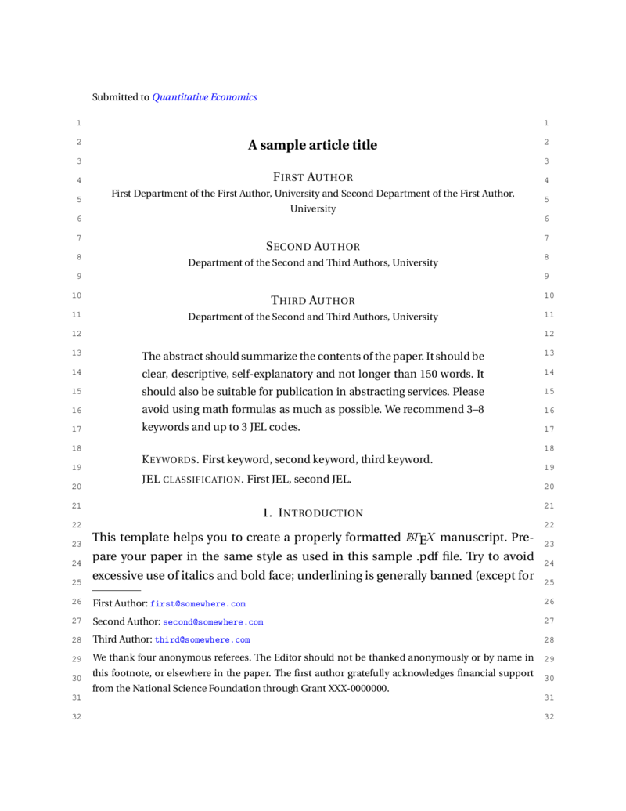

# Econometric Society Journals MyST Template

MyST Markdown template for Econometric Society journal submissions: Econometrica, Quantitative Economics, and Theoretical Economics.

> **Unofficial.** This is an independent, community-maintained MyST template. It
> is not produced, endorsed, or supported by The Econometric Society, by VTeX, or
> by any of the three journals. The official LaTeX templates are the ones linked
> below; this project packages them for MyST Markdown authoring. Bugs here are
> not their responsibility, and acceptance of a submission produced with this
> template is at each journal's discretion. Always check the output against the
> journal's own current requirements before submitting.



- **Template**: [github.com/alanlujan91/qe_template](https://github.com/alanlujan91/qe_template)
- **Author**: Alan Lujan
- **Based on**: the official Econometric Society LaTeX templates, tracked as submodules under `original/`
  - [Econometrica](https://github.com/vtex-soft/texsupport.econometricsociety-ecta) (`original/ecta`)
  - [Quantitative Economics](https://github.com/vtex-soft/texsupport.econometricsociety-qe) (`original/qe`)
  - [Theoretical Economics](https://github.com/vtex-soft/texsupport.econometricsociety-te) (`original/te`)
- **Journals**: [Econometrica](https://www.econometricsociety.org/publications/econometrica), [Quantitative Economics](https://qeconomics.org/), [Theoretical Economics](https://econtheory.org/)

## Features

- **All three Econometric Society journals**: one template targets Quantitative Economics, Econometrica, and Theoretical Economics via the `journal` option, with a neutral `preprint` default
- **Official `econsocart` class**: all required style files, faithful journal layout
- **MyST Markdown authoring**: write in Markdown, compile to LaTeX/PDF
- **Author management**: multiple authors and affiliations with proper formatting
- **Document parts**: abstract, acknowledgements/funding, appendix (as frontmatter parts)
- **Bibliography**: BibTeX integration, with the style selected to match the target journal (`econsoc.bst` for Econometrica, `qe.bst` for Quantitative Economics, `te.bst` for Theoretical Economics)
- **Supplement support**: supplementary material via `supplement` option
- **Broad LaTeX support**: bundles the packages MyST recognizes but does not auto-inject (algorithms, subfigures, table helpers, ...), plus an `extra_packages` option for anything else
- **Template options**: draft mode, section-based equation numbering, open access

## Quick Start

### 1. Install MyST

```bash
npm install -g mystmd
# or
uv tool install mystmd
```

### 2. Create Your Document

Create a Markdown file with proper frontmatter:

```yaml
---
title: Your Paper Title
short_title: Running Head Title
date: 2025-01-15
license: CC-BY-4.0
open_access: true
exports:
  - format: tex+pdf
    template: https://github.com/alanlujan91/qe_template
    output: paper.pdf
authors:
  - name:
      given: First
      surname: Author
    email: first@author.edu
    affiliations: ["aff1"]
  - name:
      given: Second
      surname: Author
    email: second@author.edu
    affiliations: ["aff2"]
affiliations:
  - id: aff1
    department: Department of Economics
    institution: First University
  - id: aff2
    department: Business School
    institution: Second University
keywords:
  - keyword 1
  - keyword 2
  - keyword 3
tags:
  - C00
  - D00
bibliography: references.bib
venue:
  title: Quantitative Economics
  url: https://qeconomics.org/
parts:
  abstract: |
    Your abstract here (max 150 words recommended).
    Should be clear, descriptive, and self-explanatory.
  acknowledgement: |
    We thank reviewers and acknowledge funding sources.
    Do not thank the editor by name.
  appendix: appendix.md
---

# Introduction

Your content here...
```

This example sets no `journal`, so it builds a neutral **preprint** (no "Submitted to ..." banner). Add `journal: qe` (or `ecta`/`te`) to the export when you submit.

### 3. Build PDF

```bash
myst build paper.md --pdf
```

### 4. See Complete Examples

- Main article: [`sample/article.md`](sample/article.md)
- Supplementary material: [`sample/supplement.md`](sample/supplement.md)

## Template Options

Configure via `exports` in frontmatter:

| Option | Type | Default | Description |
| --- | --- | --- | --- |
| `journal` | choice | `preprint` | `preprint` (default) produces a neutral working-paper PDF with no journal identification. `qe`/`ecta`/`te` format for Quantitative Economics / Econometrica / Theoretical Economics (sets the class option, running head, and "Submitted to ..." banner). See [Preprint vs journal mode](#preprint-vs-journal-mode). |
| `draft` | boolean | `false` | Draft mode for initial submission |
| `supplement` | boolean | `false` | Supplementary material document |
| `seceqn` | boolean | `false` | Number equations by section (e.g., Equation 2.1) |
| `linenumbers` | boolean | `false` | Line numbers appear automatically in `draft` mode; this only toggles them *within* draft and has no effect in final mode. |
| `extra_packages` | string | (none) | Comma-separated LaTeX packages to load, e.g. `mhchem,cancel` (see [LaTeX Packages](#latex-packages)) |

The `open_access` frontmatter field automatically enables the econsocart `openaccess` class option.

#### Preprint vs journal mode

By default (`journal: preprint`) the PDF carries **no journal identification**: no "Submitted to ..." banner, no journal running head, and no copyright line. It is safe to post as a working paper without signaling where it was submitted, and uses the Quantitative Economics layout. When you are ready to submit, set `journal` to the target:

```yaml
exports:
  - format: tex+pdf
    template: https://github.com/alanlujan91/qe_template
    output: paper.pdf
    journal: ecta   # renders "Submitted to Econometrica"
```

Example with options:

```yaml
exports:
  - format: tex+pdf
    template: https://github.com/alanlujan91/qe_template
    output: paper.pdf
    draft: true
```

Draft mode adds line numbers (in both margins) and a "Submitted to ..." banner (unless `journal: preprint`).

**Note**: Use `acknowledgement` (singular) in frontmatter, not `acknowledgements`.

## MyST Implementation Details

### Approach

This template uses MyST native features wherever possible and falls back to raw LaTeX for complex tables and algorithms that exceed MyST's native capabilities.

### MyST Native Features

#### Typography

- **Emphasis**: `*italic*` and `**bold**` instead of `\textit{}` and `\textbf{}`
- **Math**: Standard MyST math with `$...$` and `` ```math `` blocks
- **Inline code**: backticks, rendered as `\texttt{...}` (not `\verb`)
- **Headings**: Markdown `#`, `##`, `###` for sections
- **Note**: Other text styles (small caps, sans serif) require inline LaTeX: `\textsc{}`, `\textsf{}`

#### Citations

- `` {cite:t}`ref` `` for textual citations (e.g., "Smith (2020)") renders as `\citet{}`
- `` {cite:p}`ref` `` for parenthetical citations (e.g., "(Smith 2020)") renders as `\citep{}`
- MyST recognizes other roles too (`{cite:author}`, `{cite:year}`, ...), but its LaTeX renderer collapses them all to `\citet`/`\citep`. The QE sample's author-only (`\citeauthor`) and year-only (`\citeyear`) cites therefore cannot be reproduced in the PDF; see [Limitations and Fidelity](#myst-limitations-and-fidelity-to-the-qeecma-template). See also the [MyST Citations Guide](https://mystmd.org/guide/citations).

#### Lists

- Itemized lists: Markdown `-` syntax
- Numbered lists: Markdown `1.`, `2.`, etc.

#### Footnotes

- Markdown footnote syntax: `[^1]` with `[^1]: Footnote text.` at the bottom

#### Quotations

- Markdown blockquote syntax with `>` prefix
- MyST converts to `\begin{quote}` in LaTeX
- See [MyST Typography Guide](https://mystmd.org/guide/typography#quotations)

#### Theorem-like Environments

MyST proof directives that produce correct LaTeX output:

| MyST Directive | LaTeX Environment |
| --- | --- |
| `{prf:theorem}` | `\begin{theorem}` |
| `{prf:lemma}` | `\begin{lemma}` |
| `{prf:proposition}` | `\begin{proposition}` |
| `{prf:corollary}` | `\begin{corollary}` |
| `{prf:definition}` | `\begin{definition}` |
| `{prf:example}` | `\begin{example}` |
| `{prf:remark}` | `\begin{remark}` |
| `{prf:axiom}` | `\begin{axiom}` |
| `{prf:conjecture}` | `\begin{conjecture}` |
| `{prf:observation}` | `\begin{observation}` |
| `{prf:proof}` | `\begin{proof}` |

The template fixes MyST's default section-based numbering (Theorem 1.1) to use global counters (Theorem 1) as required by QE.

**Note**: `claim` and `fact` are not supported by MyST's proof directives. The sample uses `{prf:proposition}` and `{prf:observation}` as substitutes.

See [MyST Proofs & Theorems](https://mystmd.org/guide/proofs-and-theorems) for details.

#### Appendices

Appendices are handled through the `parts` frontmatter:

```yaml
parts:
  appendix: appendix.md
```

The template wraps the content in `\begin{appendix}...\end{appendix}` and promotes headings to the correct level (MyST demotes part content by one level, which the template corrects). Cross-reference appendices with explicit links such as `[Appendix A](#appA)` rather than `@appA` (see [Cross-References](#cross-references) above for why).

The `appendix.md` file is plain MyST with no raw LaTeX needed:

```markdown
---
title: Appendix
numbering:
  heading_1: true
  heading_2: true
---

(appA)=

# Title of first appendix

Content here...
```

#### Equations

- Inline math: `$...$`
- Display math: `` ```math `` blocks with optional `:label:` for numbered equations
- Multi-line equations with a single number: use `\begin{aligned}` inside a `{math}` block with `:label:`
- Equation arrays: use `\begin{align}` inside a `` ```math `` block
- Reference equations with `` {eq}`label` ``

#### Cross-References

- **Theorems, Lemmas, etc.**: `@th1` renders as "Theorem 1" (`Theorem~\ref{th1}`)
- **Definitions**: `@de1` renders as "Definition 1"
- **Tables**: `` {numref}`my-table` `` renders as "Table 1"
- **Figures**: `` {numref}`my-fig` `` renders as "Figure 1"
- **Equations**: `` {eq}`label` `` renders as "(1)"
- **Sections**: `@s1` renders the section **title** (e.g., "Introduction"), not the number. This is a [known MyST limitation](https://github.com/executablebooks/mystmd/issues/1924).
- **Appendices**: the same limitation applies, so `@appA` renders the appendix *title*, not "Appendix A". Use an explicit link with your own text instead: `[Appendix A](#appA)`. Formula, theorem, table, and figure references (`{eq}`, `@th1`, `` {numref}` ``) are unaffected and render numbers correctly. See [`sample/appendix.md`](sample/appendix.md).

See [MyST Cross-references Guide](https://mystmd.org/guide/cross-references) for complete details.

### Where We Use Raw LaTeX

#### Complex Tables

Tables with custom column specifications, `\hline`, `\cline`, `\legend{}`, and precise alignment require raw LaTeX `{raw} latex` blocks. MyST's table syntax cannot reproduce these layouts.

#### Algorithms

The template bundles the `algorithm` and `algpseudocode` packages. MyST has no native pseudocode directive and does not auto-inject these packages, so write algorithms inside a `{raw} latex` block using the standard `algorithm` and `algorithmic` environments.

### MyST Limitations and Fidelity to the QE/ECMA Template

Authoring in Markdown means the generated LaTeX is not byte-identical to a hand-written QE `.tex`. The first table below lists differences where the rendered **PDF is still equivalent** to the original; the second lists **genuine limitations** where it is not. Each records the workaround where one exists.

#### Irreducible rendering differences (same PDF, different source)

| Feature | Hand-written QE | MyST output |
| --- | --- | --- |
| Preamble | you write `\usepackage` lines | injected automatically (see [LaTeX Packages](#latex-packages)) |
| Inline code | `` \verb|\cmd| `` | `\texttt{{\textbackslash}cmd}` |
| Equation arrays | `eqnarray` | `align` (the non-deprecated equivalent) |
| Long quotation | `\begin{quotation}` | `\begin{quote}` (all blockquotes) |
| Emphasis | `\emph{}` | `\textit{}` |
| Figures | `\includegraphics{figure_sample}` | `files/figure_sample-<hash>.pdf` (assets copied and content-hashed) |
| Whitespace | hand-formatted | normalized |

#### Genuine limitations (a QE feature MyST cannot reproduce in the PDF)

| Feature | Limitation | Workaround |
| --- | --- | --- |
| Section / appendix cross-references | `@s1` / `@appA` render the heading *title*, not the number/letter ([issue #1924](https://github.com/executablebooks/mystmd/issues/1924)) | write explicit text: `[Appendix A](#appA)`. Equation (`{eq}`), theorem (`@th1`), table/figure (`` {numref}` ``) refs are unaffected |
| Author-only / year-only citations | `{cite:author}` / `{cite:year}` collapse to `\citet` / `\citep` in LaTeX | none in the PDF; the QE sample's `\citeauthor` / `\citeyear` examples appear as `\citet` / `\citep` |
| `claim` / `fact` results | see [Proof directives](#proof-directives) below | `{prf:proposition}` / `{prf:observation}`, or a `{raw} latex` `\begin{claim}` block (the environments are defined) |
| Small caps / sans serif in text | no Markdown syntax | inline `\textsc{}` / `\textsf{}` |

#### Proof directives

MyST's LaTeX renderer maps only **11** `{prf:...}` kinds to environments: `theorem, proof, proposition, definition, example, remark, axiom, conjecture, lemma, observation, corollary`. Any other kind, including `{prf:algorithm}`, `{prf:claim}`, `{prf:criterion}`, `{prf:property}`, `{prf:assumption}`, `{prf:exercise}`, and `{prf:solution}`, raises a build error ("Unhandled LaTeX proof environment") and is **dropped from the PDF** (it still renders in HTML). By default MyST does not hard-abort on this, so watch the build log. Use a supported kind, or write the environment in a `{raw} latex` block.

#### LaTeX packages

Three groups of packages are available in every build:

1. **Auto-injected by MyST** when its own content needs them (never declared): `booktabs, pdflscape, longtable, amsmath, amsthm, imakeidx, listings, minted, ulem, framed, graphicx, natbib, siunitx, glossaries, xcolor`.
2. **Provided by the class and template:** `amssymb, bm, etoolbox, fontenc, textcomp, times, url` (class) and `hyperref` (template). These are declared in `packages:`, so MyST does not re-inject them.
3. **Loaded by the template** (packages MyST recognizes but does not auto-inject, so raw-LaTeX content that uses them compiles): `algorithm, algpseudocode, subcaption, multirow, tabularx, wrapfig, threeparttable, adjustbox, changepage, mhchem, cancel, supertabular, epigraph, cleveref`.

Because group 3 is loaded unconditionally, **your TeX installation must contain these packages**. A full TeX Live has them; on a minimal install add them with `tlmgr install <name>`.

Three packages are deliberately **excluded** because they conflict with the class or bibliography: `soul` (its `\caps` clashes with the class), `csquotes` (its `\enquote` clashes with `qe.bst`), and `algorithm2e` (its `\algorithm` clashes with `algorithm`). MyST already uses `ulem` for strikethrough, so `soul` is not needed.

For any package **beyond** these groups (e.g. `tikz`, `pgfplots`), use the `extra_packages` export option:

```yaml
exports:
  - format: tex+pdf
    template: https://github.com/alanlujan91/qe_template
    output: paper.pdf
    extra_packages: tikz,pgfplots
```

## Supplement Template

For supplementary material, use the same template with `supplement: true`:

```yaml
exports:
  - format: tex+pdf
    template: https://github.com/alanlujan91/qe_template
    output: supplement.pdf
    supplement: true
```

In supplement mode, the template skips funding, coeditor, keywords, and JEL code sections. Abstract is optional. See [`sample/supplement.md`](sample/supplement.md) for a working example.

## Local Development

### Preview Website

```bash
myst start
```

### Build PDF

```bash
myst build your-paper.md --pdf
```

### Troubleshooting

**LaTeX compilation errors**:

1. **Missing fonts**: The `econsocart` class loads the `times` package (Times Roman via `psnfss`), which ships with every TeX distribution. If it is somehow missing, `tlmgr install psnfss`.
2. **Missing bibliography**: Ensure `bibliography: file.bib` in frontmatter and the file exists.
3. **Author format**: Check name structure matches the example above.
4. **Citations**: Verify all `{cite:}` references have matching BibTeX entries.
5. **Math**: Ensure all `$` and `$$` are properly closed.
6. **`Undefined control sequence ... \counterwithout`**: The theorem-numbering fix uses `\counterwithout`, a LaTeX2e kernel command added in the 2023-06-01 release. Update to TeX Live 2023 or newer.
7. **Line numbers overlapping text in `draft` mode**: `draft` prints line numbers in both margins. Content wider than the text block (an `Overfull \hbox`) spills into the margin and collides with them. This is over-wide content, not the line numbers: search the build log for `Overfull \hbox ... too wide`, then break the wide equation (`align`/`multline`), shorten the long token, or wrap the wide table/figure in `\resizebox{\linewidth}{!}{...}`.

**Common issues**:

- **"Template not found"**: Check `exports` -> `template` path is correct
- **"Bibliography not found"**: Ensure `.bib` file is in the correct location

**Getting help**:

- Check [`sample/article.md`](sample/article.md) for a working example
- Review [MyST Documentation](https://mystmd.org)
- Open an [issue](../../issues) for template-specific problems

## Template Files

- `template.tex` - Main template file (Jinja2 syntax)
- `template.yml` - Template configuration and options
- `econsocart.cls` - Econometric Society document class (shared by all three journals)
- `econsocart.cfg` - Econometric Society class configuration (shared)
- `econsoc.bst` - Econometrica bibliography style
- `qe.bst` - Quantitative Economics bibliography style
- `te.bst` - Theoretical Economics bibliography style
- `thumbnail.png` - Template preview
- `sample/` - Complete working examples (main article and supplement)
- `scripts/sync-vendored.sh` - Re-vendors the files above from `original/*`
- `original/{ecta,qe,te}/` - Pinned upstream templates (git submodules)

The class and configuration are one shared file across the three journals, so
they are vendored from whichever submodule ships the newest release; each `.bst`
comes from its own journal. `scripts/sync-vendored.sh` encodes that rule, and the
`check-upstream-drift` CI job enforces it.

## License and Attribution

This repository contains work under **two different licenses**. They are not
interchangeable, and the upstream files cannot be relicensed by this project.

### Upstream files (LPPL 1.3c, not ours)

`econsocart.cls`, `econsocart.cfg`, `econsoc.bst`, `qe.bst`, and `te.bst` are the
official Econometric Society class and bibliography style files. They are

- **Copyright (c) 2022 UAB "VTeX"** (TeX programming: Edgaras Sakuras, VTeX, Lithuania)
- licensed under the [LaTeX Project Public License (LPPL) v1.3c](https://www.latex-project.org/lppl/) or any later version
- redistributed here **verbatim**, with their copyright and license headers intact

They are vendored (copied) rather than submoduled so the template stays
self-contained when MyST fetches it, since MyST does not fetch submodules. The
`check-upstream-drift` CI job asserts these copies remain byte-identical to the
pinned upstreams, which is also what keeps this repository on LPPL's
unmodified-distribution path: LPPL requires renaming a file if you distribute a
modified version, and nothing here modifies them.

Upstream sources, tracked as submodules under `original/`:

- [texsupport.econometricsociety-ecta](https://github.com/vtex-soft/texsupport.econometricsociety-ecta) - Econometrica
- [texsupport.econometricsociety-qe](https://github.com/vtex-soft/texsupport.econometricsociety-qe) - Quantitative Economics
- [texsupport.econometricsociety-te](https://github.com/vtex-soft/texsupport.econometricsociety-te) - Theoretical Economics

Official distribution point: <https://www.e-publications.org/es/support/>

### This template's own files (CC-BY-4.0)

`template.tex`, `template.yml`, `myst.yml`, `scripts/`, the `sample/` documents,
and this documentation are original work by Alan Lujan, licensed **CC-BY-4.0**.

### Trademarks and endorsement

"Econometrica", "Quantitative Economics", "Theoretical Economics", and The
Econometric Society's names and marks belong to their respective owners. They
are used here only to identify the target journal of a submission. See the
unofficial notice at the top of this README.

- **MyST Tools**: [MyST Markdown](https://mystmd.org)

## Contributing

Contributions are welcome! See [CONTRIBUTING.md](.github/CONTRIBUTING.md) for development setup, workflow documentation, and guidelines.
