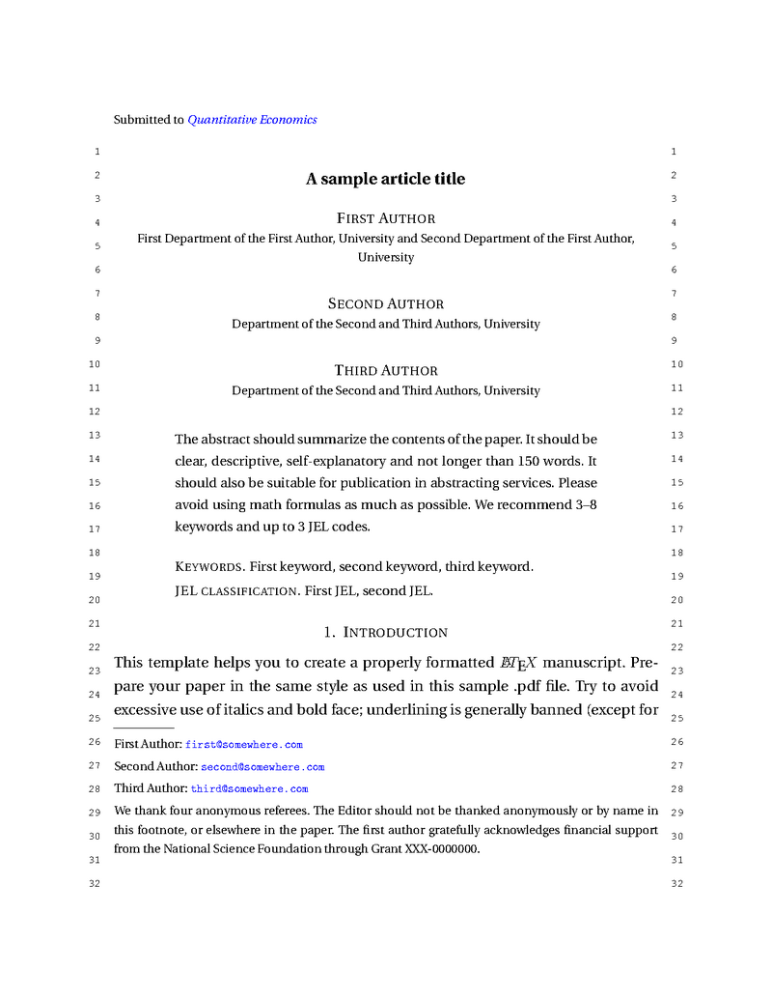

# Quantitative Economics MyST Template

MyST Markdown template for Quantitative Economics journal submissions.



- **Template**: [github.com/alanlujan91/qe_template](https://github.com/alanlujan91/qe_template)
- **Author**: Alan Lujan
- **Based on**: [Official QE LaTeX Template](https://github.com/vtex-soft/texsupport.econometricsociety-qe)
- **Journal**: [Quantitative Economics](https://qeconomics.org/)

## Features

- **Full QE journal support**: Uses official `econsocart` class with all required style files
- **MyST Markdown authoring**: Write in Markdown, compile to LaTeX/PDF
- **Author management**: Multiple authors and affiliations with proper formatting
- **Document parts**: Abstract, acknowledgements/funding, appendix
- **Bibliography**: BibTeX integration with `qe.bst` style
- **Draft/Final modes**: Toggle between submission and publication versions
- **Automated validation**: Pre-commit hooks and CI/CD ensure quality
- **Upstream tracking**: Automatic synchronization with official QE template updates

## Quick Start

### 1. Install MyST

```bash
npm install -g mystmd
# or
uv tool install mystmd
```

### 2. Create Your Document

Create a Markdown file with proper frontmatter:

```yaml
---
title: Your Paper Title
short_title: Running Head Title
date: 2025-01-15
license: CC-BY-4.0
open_access: true
exports:
  - format: tex+pdf
    template: https://github.com/alanlujan91/qe_template
    output: paper.pdf
    draft: true  # or final: true for publication
authors:
  - name:
      given: First
      surname: Author
    email: first@author.edu
    affiliations: ["aff1"]
  - name:
      given: Second
      surname: Author
    email: second@author.edu
    affiliations: ["aff2"]
affiliations:
  - id: aff1
    department: Department of Economics
    institution: First University
  - id: aff2
    department: Business School
    institution: Second University
keywords:
  - keyword 1
  - keyword 2
  - keyword 3
tags:
  - C00
  - D00
bibliography: references.bib
venue:
  title: Quantitative Economics
  url: https://qeconomics.org/
parts:
  abstract: |
    Your abstract here (max 150 words recommended).
    Should be clear, descriptive, and self-explanatory.
  acknowledgement: |
    We thank reviewers and acknowledge funding sources.
    Do not thank the editor by name.
---

# Introduction

Your content here...
```

### 3. Build PDF

```bash
myst build paper.md --pdf
```

### 4. See Complete Example

A working example is available in [`sample/qe_sample.md`](sample/qe_sample.md).

## Template Options

Configure via `exports` in frontmatter:

| Option  | Type    | Default | Description                       |
| ------- | ------- | ------- | --------------------------------- |
| `draft` | boolean | `true`  | Draft mode for initial submission |
| `final` | boolean | `false` | Final mode for prepublication     |

**Note**: Use `acknowledgement:` (singular) in frontmatter, not `acknowledgements`.

## MyST Implementation Details

### Approach

This template balances **MyST native features** with **raw LaTeX** to stay as close as possible to the official Quantitative Economics template while maintaining good authoring experience.

### Where We Use MyST Native Features

#### Typography

- **Emphasis**: Use `*italic*` and `**bold**` instead of `\textit{}` and `\textbf{}`
- **Math**: Standard MyST math with `$...$` and `$$...$$`
- **Inline code**: Use backticks for `\verb|...|` commands
- **Headings**: Use markdown `#`, `##`, `###` for sections
- **Note**: Other text styles (small caps, sans serif, etc.) require raw LaTeX: `\textsc{}`, `\textsf{}`, etc.

#### Citations

- `{cite:t}\`ref\`` for textual citations (e.g., "Smith (2020)")
- `{cite:p}\`ref\`` for parenthetical citations (e.g., "(Smith 2020)")
- `{cite:author}\`ref\`` for author-only
- `{cite:year}\`ref\`` for year-only
- Small formatting differences are acceptable

#### Lists

- **Simple lists**: Use markdown `-` for itemize
- **Simple numbered lists**: Use markdown `1.`, `2.`, etc.

#### Footnotes

- Use markdown footnote syntax `[^1]`

#### Short Quotations

- Use markdown blockquote syntax with `>` prefix for single-paragraph quotes
- MyST converts to `\begin{quote}` environment in LaTeX
- See [MyST Typography Guide](https://mystmd.org/guide/typography#quotations) for details

#### Theorem-like Environments

- Use MyST proof directives: `{prf:theorem}`, `{prf:proof}`, `{prf:lemma}`, `{prf:axiom}`, `{prf:definition}`, `{prf:example}`, `{prf:remark}`
- These automatically handle numbering and LaTeX output
- See [MyST Proofs & Theorems](https://mystmd.org/guide/proofs-and-theorems) for details
- **Note**: `claim` and `fact` environments use raw LaTeX (MyST doesn't support these)

#### Cross-References

MyST provides powerful cross-referencing, but **the syntax depends on whether the target is MyST-native or raw LaTeX**:

**Important**: `\ref{}` commands **only work inside `{raw} latex` blocks**. In regular markdown content, you must use MyST cross-reference syntax (`{numref}`, `{eq}`, `[text](#label)`, etc.).

**For MyST Native Elements** (use MyST roles):
- **Theorems, Lemmas, Axioms, etc.**: `{numref}`th1`` renders as "Theorem 1.1"
- **Tables**: `{numref}`my-table`` renders as "Table 1"
- **Figures**: `{numref}`my-fig`` renders as "Figure 1"
- **Sections**: `[Section {name}](#s1)` or `[Section %s](#s1)` renders as "Section Introduction" or "Section 1"

**For Equations**:
- **MyST equations** (with `:label:` directive): Use `{eq}`label`` renders as "(1)"
- **Raw LaTeX equations** (with `\label{}` inside `\begin{align}`, etc.): **Must use `(\ref{label})`**
  - **Critical**: MyST's `{eq}` role **cannot track** labels inside raw LaTeX math blocks
  - Example: If equation has `\label{e7}` inside `\begin{align}`, reference it with `(\ref{e7})`

**For Raw LaTeX Elements**:
- **Claims, Facts** (raw LaTeX environments): Must use `\ref{cl1}` **inside** raw LaTeX blocks
- Any label defined with `\label{}` inside raw LaTeX: Use `\ref{}` **inside** raw LaTeX blocks
- **Critical**: `\ref{}` commands **only work inside** `{raw} latex` blocks. Outside these blocks, use MyST cross-reference syntax.

See [MyST Cross-references Guide](https://mystmd.org/guide/cross-references) for complete details.

### Where We Use Raw LaTeX

#### Complex Tables

- Tables with custom column specifications, `\hline`, `\cline`, etc.
- Tables requiring precise alignment and `\legend{}` commands
- **Reason**: MyST's table syntax is too limited for academic paper requirements

#### Custom Enumerated Lists

- Lists with manual labels like `\item[(i)]`, `\item[(ii)]`, `\item[(iii)]`
- **Reason**: MyST doesn't support custom enumeration labels (beyond starting number)

#### Long Quotations (multi-paragraph)

- Use raw LaTeX `\begin{quotation}...\end{quotation}` for multi-paragraph quotes
- **Reason**: MyST's blockquote syntax produces `\begin{quote}`, but longer quotes should use `\begin{quotation}` with paragraph indentation

#### Multi-line Equations with Inline Labels

- **Simple equations**: Use MyST `{math}` blocks with `:label:` directive:
  ```markdown
  ```{math}
  :label: my-eq
  E = mc^2
  ```
  ```
  Reference with `{eq}`my-eq`` renders as "(1)"

- **Multi-line equations with `\label{}` inside**: Use raw LaTeX blocks:
  ```markdown
  ```{raw} latex
  \begin{eqnarray}
  a & = & b \nonumber\\
  c & = & d. \label{my-eq}
  \end{eqnarray}
  ```
  ```
  Reference with `(\ref{my-eq})` renders as "(2)"
  - **Note**: `{eq}` role will NOT work here; only `\ref{}` preserves the reference

- **Critical Limitation**: MyST **strips** `\label{}` commands from inside `{math}` blocks (e.g., `\begin{align}`, `\begin{eqnarray}`)
- **Reason**: For equations like `\begin{eqnarray}...\label{e7}\end{eqnarray}`, the label must survive to the LaTeX output. Only raw LaTeX blocks preserve inline `\label{}` commands.

#### Author/Affiliation Block

- Handled via template.tex with proper `\author[]{}` and `\address[]{}` commands
- **Reason**: Requires exact format for journal production system

### Known Acceptable Differences

When comparing the MyST-generated LaTeX output to the original QE template, the following differences are expected and acceptable:

#### Formatting & Spacing

1. **Line breaks/spacing**: MyST normalizes whitespace (double spaces after periods to single spaces, line wrapping differs)
2. **Paragraph formatting**: Content is identical but may reflow differently

#### Citation Differences

3. **Citation commands**: MyST converts citation roles to LaTeX commands:
   - `{cite:author}` becomes `\citet{}` (original uses `\citeauthor{}`)
   - `{cite:year}` becomes `\citet{}` (original uses `\citeyear{}`)
   - Citation spacing: `{b2,b3,b4}` becomes `{b2, b3, b4}` (spaces added after commas)
   - **Workaround**: Use raw LaTeX `\citeauthor{}` and `\citeyear{}` directly if exact match required

#### Theorem Environments

4. **Theorem numbering**: MyST's `{prf:}` directives always generate section-numbered theorems:
   - MyST behavior: `\newtheorem{theorem}{Theorem}[section]` produces "Theorem 1.1", "Theorem 1.2"
   - Original template: `\newtheorem{theorem}{Theorem}` produces "Theorem 1", "Theorem 2"
   - This is inherent to MyST's proof directive implementation and cannot be changed
   - Template enables `numbering:` for headings to keep document internally consistent
   - Template keeps standard environments (`claim`, `fact`) for raw LaTeX usage
   - Alternative: use raw LaTeX for all theorems if global numbering is required

#### Cross-References

5. **Equation references**: Mix of MyST and raw LaTeX syntax
   - MyST native equations: `{eq}` role generates `(\ref{...})`
   - Raw LaTeX equations (with `\label{}` inside math blocks): Must use `(\ref{...})` directly
   - **Reason**: MyST's `{eq}` role cannot track labels inside raw LaTeX blocks
   - Both render identically in final PDF

#### Figures & Tables

6. **Figure paths**: MyST copies figures to `files/` with content-hash filenames
   - Original: `\includegraphics{figure_sample}`
   - MyST: `\includegraphics[width=0.7\linewidth]{files/figure_sample-<hash>.pdf}`
7. **Table legends**: MyST doesn't support `\legend{}` command inside tables
   - **Workaround**: Use `**Table note:**` paragraph after table (as in sample)

#### Package & Environment Differences

8. **Preamble additions**: MyST adds explicit imports in addition to template-defined packages
   - Template includes: `amssymb`, `bm`, `etoolbox`, `fontenc`, `hyperref`, `textcomp`, `times`, `url`
   - MyST may add: `amsmath`, `amsthm`, `graphicx`, `natbib` as needed
   - See `packages:` list in [`template.yml`](template.yml)
9. **Equation environments**:
   - MyST-native math blocks use `align` (modern best practice)
   - Multi-line equations with inline `\label{}` commands preserve original environment (`eqnarray`, etc.) via raw LaTeX blocks
   - **Reason**: Preserving inline labels requires raw LaTeX; see "Multi-line Equations with Inline Labels" section

#### What Works Correctly

- **Short quotations**: Markdown `>` blockquotes convert to `\begin{quote}`
- **Long quotations**: Raw LaTeX `\begin{quotation}` preserved
- **Funding section**: `acknowledgement:` frontmatter converts to `\begin{funding}`
- **Bibliography**: External `.bib` files via `\bibliography{}` command

## Local Development

### Preview Website

Preview website locally:

```bash
myst start
```

Build PDF manually:

```bash
myst build your-paper.md --pdf
```

### Troubleshooting

**LaTeX compilation errors**:

1. **Missing bibliography**: Ensure `bibliography: file.bib` in frontmatter and file exists
2. **Author format**: Check name structure matches example above
3. **Citations**: Verify all `{cite:}` references have matching BibTeX entries
4. **Math**: Ensure all `$` and `$$` are properly closed
5. **Tables**: Check all `\begin{table}` have matching `\end{table}`

**Common issues**:

- **"Missing acknowledgement"**: Use `acknowledgement:` (singular) not `acknowledgements:`
- **"Template not found"**: Check `exports:` -> `template:` path is correct
- **"Bibliography not found"**: Ensure `.bib` file is in correct location

**Getting help**:

- Check [`sample/qe_sample.md`](sample/qe_sample.md) for working example
- Review [MyST Documentation](https://mystmd.org)
- Open an [issue](../../issues) for template-specific problems

## Template Files

- `template.tex` - Main template file (Jinja2 syntax)
- `template.yml` - Template configuration
- `econsocart.cls` - QE document class
- `econsocart.cfg` - QE configuration
- `qe.bst` - QE bibliography style
- `thumbnail.png` - Template preview
- `sample/` - Complete working example

## License

- **License**: CC-BY-4.0
- **Based on**: Official [Quantitative Economics LaTeX Template](https://github.com/vtex-soft/texsupport.econometricsociety-qe)
- **Journal**: [Quantitative Economics](https://qeconomics.org/)
- **MyST Tools**: [MyST Markdown](https://mystmd.org)

## Contributing

Contributions are welcome! See [CONTRIBUTING.md](.github/CONTRIBUTING.md) for development setup, workflow documentation, and guidelines.
